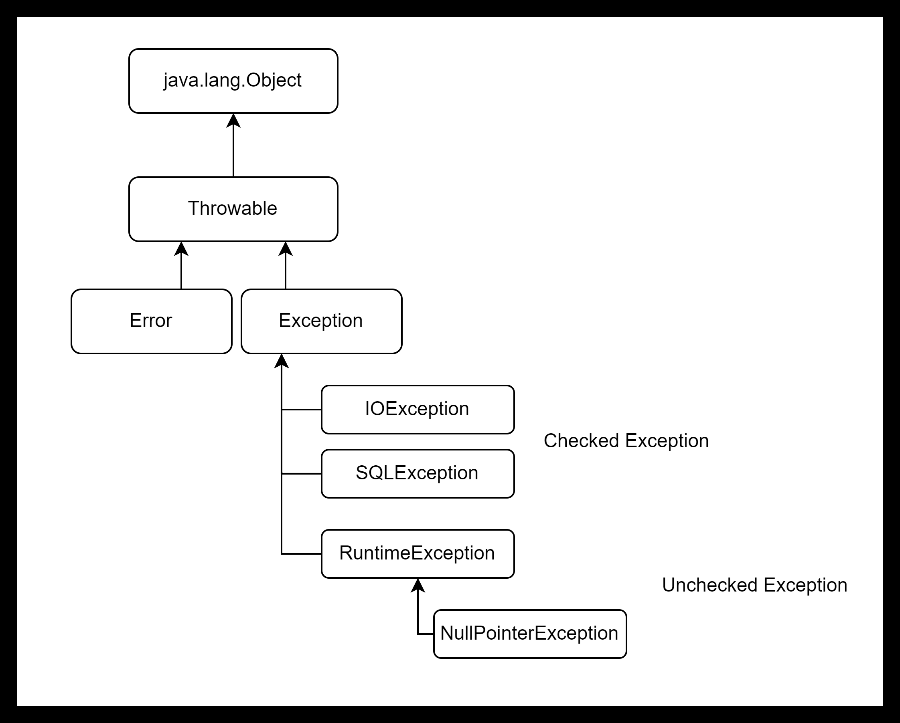

# About Exception Handling

## Error vs Exception

예외와 에러의 차이는 무엇인가?  
예외(Exception) : 입력 값의 처리가 불가능하거나 참조된 값이 잘못된 경우 등 **애플리케이션이 정상적으로 동작하지 못하는 상황**  
-> 개발자가 직접 처리할 수 있으므로 미리 코드 설계를 통해 처리!

에러(Error) : Spring에서는 JVM에서 발생시키는 것으로 **예외와 달리 애플리케이션 코드에서 처리할 수 있는 것의 거의 없음**  
-> 메모리 부족(OutOfMemory), 스택 오버플로우(StackOverFlow) 등이 있음  
-> 미리 애플리케이션 코드를 살펴보면서 문제가 발생하지 않도록 예방해서 원천적으로 차단해야 함!

## Exception Class



모든 예외 클래스는 Throwable 클래스를 상속받고,  
Exception 클래스는 Checked Exception과 Unchecked Exception으로 나뉨

Checked Exception : 반드시 예외 처리가 필요한 예외로, 컴파일 단계에서 확인이 가능한 예외, (IOException, SQLException...)  
Unchecked Exception : 예외처리가 강제되지는 않는 예외로, 런타임 단계에서 확인이 가능한 예외 (RuntimeException, NullPointerException, IllegalArgumentException...)

-> 간단하게 보자면 RuntimeException을 상속받는 Exception class = Unchecked Exception, 아니면 Checked Exception!

## Exception Handling Methods

예외 처리의 방법은 세 가지가 존재합니다

- 예외 복구

예외 상황을 파악해서 문제를 해결! (try/catch 문)

- 예외 처리 회피

예외가 발생한 시점에서 바로 처리하는 것이 아닌 예외가 발생한 메서드를 호출하는 곳에서 에러 처리를 할 수 있게 전가 (throw 문)

- 예외 전환

예외 복구 + 예외 처리 회피  

## Exception Handling in Spring boot

웹 서비스 애플리케이션에서는 외부에서 들어오는 요청에 담긴 데이터를 처리하는 경우가 잦음  
그 과정에서 예외 발생 시 예외 복구의 방식이 아닌 클라이언트에 어떤 문제가 발생했는 지 상황을 전달하는 경우가 일반적  

예외가 발생했을 때, 클라이언트에 오류 메시지를 전달하려면 각 Layer에서 발생한 예외를 엔드포인트 레벨인 컨트롤러로 전달해야 함  
이렇게 전달받은 예외를 처리하는 방법은 크게 두 가지가 있습니다

- @(Rest)ControllerAdvice와 @ExceptionHandler를 통해 모든 컨트롤러의 예외 처리
- @ExceptionHandler를 통해 특정 컨트롤러의 예외를 처리

-> @ControllerAdvice vs @RestControllerAdvice? (@ControllerAdvice + @ResponseBody !)

### @RestControllerAdvice, @ExceptionHandler

```java
@RestControllerAdvice
public class CustomExceptionHandler {
	
	@ExceptionHandler(value = RuntimeException.class)
	public ResponseEntity<Map<String, String>> handleException(RuntimeException e, HttpServletRequest request) {
		HttpHeaders responseHeaders = new HttpHeaders();
		HttpStatus httpStatus = HttpStatus.BAD_REQUEST;
		
		Map<String, String> map = new HashMap<>();
		map.put("Error Type", httpStatus.getReasonPhrase());
		map.put("code", "400");
		map.put("message", e.getMessage());
		
		return new ResponseEntity<>(map, responseHeaders, httpStatus);
	}
	
}
```

만약 @RestControllerAdvice에서 범위를 지정하는 경우 특정 패키지에서만 예외를 관제  
-> @RestControllerAdvice(basePackages = "com.springboot.valid_exception")

@(Rest)ControllerAdvice 내의 우선순위는?  
-> @(Rest)ControllerAdvice에서 @ExceptionHandler로 예외처리를 진행하는 경우 더 자세한 Exception이 우선 (RuntimeException 보다 NullPointerException이 우선순위 높음)

### @ExceptionHandler in Controller

```java
@RestController
public class ExceptionController {
	
	@GetMapping
	public void getRuntimeException() {
		throw new RuntimeException("getRuntimeException 메소드 호출");
	}
	
	@ExceptionHandler(value = RuntimeException.class)
	public ResponseEntity<Map<String, String>> handleException(RuntimeException e, HttpServletRequest request) {
		HttpHeaders responseHeaders = new HttpHeaders();
		responseHeaders.setContentType(MediaType.APPLICATION_JSON);
		HttpStatus httpStatus = HttpStatus.BAD_REQUEST;
		
		Map<String, String> map = new HashMap<>();
		map.put("Error Type", httpStatus.getReasonPhrase());
		map.put("code", "400");
		map.put("message", e.getMessage());
		
		return new ResponseEntity<>(map, responseHeaders, httpStatus);
	}
	
}
```

이처럼 구현하는 경우 해당 클래스에 국한해서 예외처리를 진행할 수 있음  
 
Controller 내에서 @ExceptionHandler로 예외처리를 하는 동시에 @(Rest)ControllerAdvice로 예외처리를 한다면?  
-> 범위가 좁은 Controller의 핸들러 메서드가 우선순위를 가짐

## CustomException

커스텀 예외를 사용하는 이유? 네이밍에 개발자의 의도를 담을 수 있음!  

### How to implement CustomException?

예외가 발생하는 상황에 해당하는 상위 예외 클래스를 상속받아서 구현  
CustomException(HttpStatus, message) 등의 형태로 정해서 상위 예외 클래스를 상속하는 방식!
